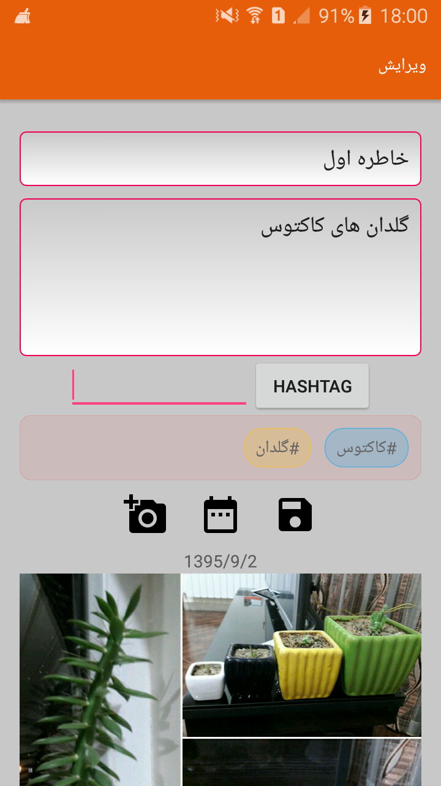
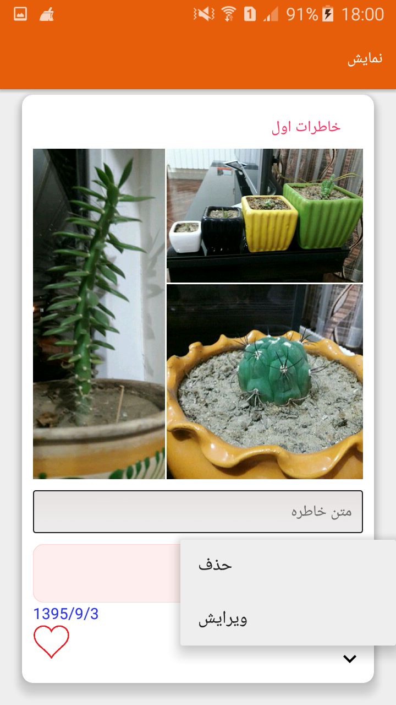
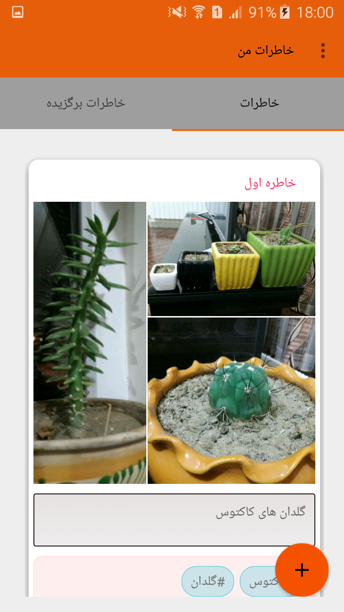
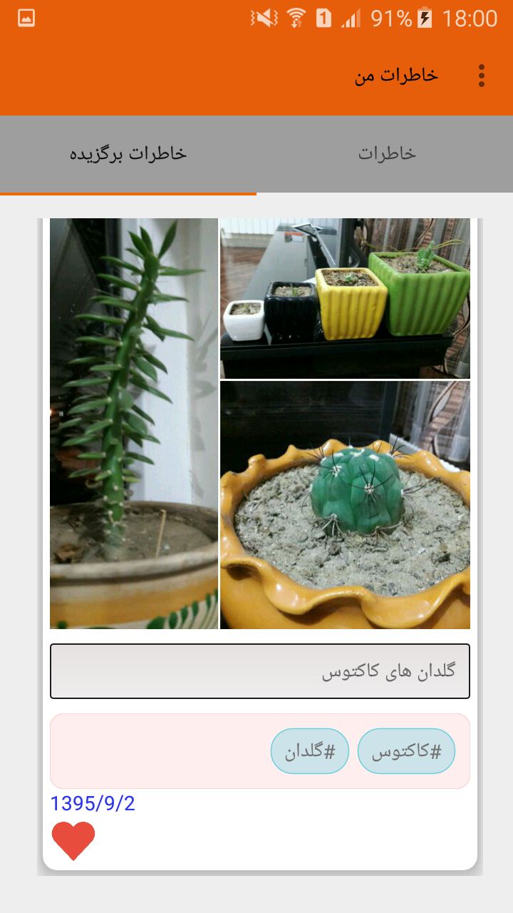

# app for Save the Memories

#Dependencies

- [Glide](https://github.com/bumptech/glide/)
- [GreenDAO](https://github.com/greenrobot/greenDAO/)
- [AndroidTagView](https://github.com/whilu/AndroidTagView/)
- [Material Dialogs](https://github.com/afollestad/material-dialogs)
- [ImagePicker](https://github.com/nguyenhoanglam/ImagePicker)
- [SunDatePicker](https://github.com/alirezaafkar/SunDatePicker)
- [RecycleView](http://www.androidhive.info/2016/05/android-working-with-card-view-and-recycler-view/)

##Screenshots

#Developed By

* Aram Khezry
 * [Twitter : AramKhezry](https://twitter.com/aramkhezry)
 * [Telegram : AramKhezry](https://telegram.me/aramkhezry)
 
#License

    Copyright 2016 Aram Khezry
